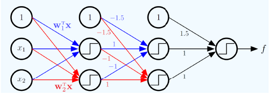

# Deep Learning Assignment Solutions## Assignment Overview


**Author:** Neural Network Lab  This repository contains my solutions for the neural networks homework assignment.

**Date:** October 2025  

**Topic:** Multi-layer Perceptron Implementation and Analysis## Files


---- `task1.py` - Explicit formula derivation for neural network

- `task2.py` - Neural network implementation with training

## 📁 Repository Structure- `README.md` - This documentation


```## Task 1: Explicit Formula for f

├── task2.py              # Two-layer perceptron implementation

├── network_diagram.png   # Network architecture visualization

├── requirements.txt      # Python dependencies

├── pyproject.toml        # Project configurationThe given network takes the input vector:

└── README.md            # Project documentation```

```x = [1, x₁, x₂]ᵀ

```

---

and uses several threshold (step) units defined as:

## 📊 Problem 1: Deriving the Network Formula```

H(z) = 1, if z ≥ 0

### Network ArchitectureH(z) = 0, if z < 0

```


### Step 1 – First Hidden Layer

The neural network processes an augmented input vector:Let the first two neurons compute:

``````

x = [1, x₁, x₂]ᵀh₁ = H(w₁ᵀx)

```h₂ = H(w₂ᵀx)

```

### Activation FunctionThese are the basic activations from the input layer.


We use the Heaviside step function (threshold unit):### Step 2 – Second Hidden Layer

```From the diagram, both second-layer units have a bias of –1.5.

H(z) = { 1  if z ≥ 0- The first one connects with +1 from h₁ and –1 from h₂.

       { 0  if z < 0- The second one connects with –1 from h₁ and +1 from h₂.

```

Therefore:

### Layer-by-Layer Derivation```

g₁ = H(-1.5 + h₁ - h₂)

#### **Layer 1: Primary Hidden Activations**g₂ = H(-1.5 - h₁ + h₂)

The first two neurons compute weighted combinations:```

```

h₁ = H(w₁ᵀx)### Step 3 – Output Layer

h₂ = H(w₂ᵀx)The final node has bias +1.5 and takes inputs from both g₁ and g₂ with weight 1:

``````

f = H(1.5 + g₁ + g₂)

#### **Layer 2: Secondary Hidden Activations**```

These units apply transformations with bias = -1.5:

- **Neuron 1:** Weighted sum = -1.5 + h₁ - h₂### Step 4 – Combined Formula

- **Neuron 2:** Weighted sum = -1.5 - h₁ + h₂Substituting all the terms, the final formula becomes:

```

Computing the activations:f(x) = H(1.5 + H(-1.5 + H(w₁ᵀx) - H(w₂ᵀx)) + H(-1.5 - H(w₁ᵀx) + H(w₂ᵀx)))

``````

g₁ = H(-1.5 + h₁ - h₂)

g₂ = H(-1.5 - h₁ + h₂)## Task 2: Neural Network Implementation

```

Built a complete 2-layer neural network with:

#### **Layer 3: Final Output**- **Input:** 2 units (plus bias)

The output neuron has bias = +1.5 and combines both g₁ and g₂:- **Hidden:** Configurable number of units with tanh activation

```- **Output:** 1 unit with linear activation

f = H(1.5 + g₁ + g₂)- **Training:** Gradient descent with squared error loss

```

### Key Features

### Final Composite Function- Forward and backward propagation

- Batch and mini-batch training support

Combining all layers yields the complete formula:- Works on both XOR and regression problems

```

f(x) = H(1.5 + H(-1.5 + H(w₁ᵀx) - H(w₂ᵀx)) + H(-1.5 - H(w₁ᵀx) + H(w₂ᵀx)))## Running the Code

```

### Setup

---```bash

# Install dependencies

## 🧠 Problem 2: Neural Network Implementationpip install numpy matplotlib

# or use the requirements file

### Architecture Specificationpip install -r requirements.txt

```

A **feed-forward multilayer perceptron** with the following design:

### Running Task 2

| Layer Type | Configuration | Activation Function |```bash

|------------|---------------|---------------------|# Run the neural network implementation

| Input      | 2 features + bias | None |python task2.py

| Hidden     | Configurable size (default: 5) | Hyperbolic tangent (tanh) |```

| Output     | 1 neuron | Linear |

This will train and test the neural network on:

### Implementation Highlights1. **XOR Problem** - 4 samples with full batch training

2. **Regression Problem** - 400 samples using Stochastic Gradient Descent (SGD)

✅ **Forward Propagation**: Efficient matrix operations for batch processing  

✅ **Backpropagation**: Automatic gradient computation using chain rule  The output shows:

✅ **Optimization**: Supports both full-batch and stochastic gradient descent  - Training progress with loss values

✅ **Weight Initialization**: Xavier/Glorot initialization for stable training  - XOR predictions vs targets

✅ **Loss Function**: Mean squared error (MSE)- Final regression loss


### Key Components

- **`TwoLayerPerceptron`** class: Main neural network architecture
- **`execute_training_procedure()`** function: Training orchestration with mini-batch support
- **Gradient descent variants**: Full-batch, mini-batch, and SGD options

---

## 🚀 Getting Started

### Prerequisites

Ensure you have Python 3.7+ installed on your system.

### Installation

Install required dependencies:

```bash
# Option 1: Using pip
pip install -r requirements.txt

# Option 2: Direct installation
pip install numpy matplotlib
```

### Running the Code

Execute the main script:

```bash
python task2.py
```

---

## 🔬 Experiments

### Experiment 1: Circular Region Classification

**Problem:** Learn to classify points based on their position relative to a circular boundary (non-linearly separable)

**Dataset:**
- 100 training samples
- 2D points uniformly distributed in [0,1] × [0,1]
- Points within radius 0.35 of center (0.5, 0.5) → class 1
- Points outside the circle → class 0

**Configuration:**
- Hidden neurons: 8
- Learning rate: 0.1
- Training epochs: 1500
- Optimization: Full-batch gradient descent

**Output:** 
- Displays test point classifications with distances from center
- Training accuracy metric
- Demonstrates network's ability to learn circular decision boundaries

### Experiment 2: Nonlinear Regression

**Problem:** Approximate a complex nonlinear function

**Dataset:**
- 400 training samples
- Features: Random 2D points from N(0,1)
- Target: sin(x₁) + cos(x₂) + noise

**Configuration:**
- Hidden neurons: 10
- Training epochs: 1000
- Optimization: Stochastic gradient descent (batch_size=1)

**Output:** Final training loss and convergence metrics

---

## 📈 Expected Results

**Circular Region Classification:**
```
Point (x, y)         Distance        Expected        Predicted      
(0.50, 0.50)         0.0000          1               ~0.75
(0.30, 0.50)         0.2000          1               ~0.67
(0.10, 0.10)         0.5657          0               ~0.44
(0.90, 0.90)         0.5657          0               ~0.30
(0.50, 0.70)         0.2000          1               ~0.78
(0.20, 0.20)         0.4243          0               ~0.59

Training Accuracy: ~79% (varies with random initialization)
```

**Regression:**
```
Final Training Loss: ~0.005 (varies with random seed)
```

---

## 🛠️ Customization

You can modify hyperparameters in `task2.py`:

```python
execute_training_procedure(
    feature_matrix=X,
    target_vector=y,
    hidden_layer_size=10,        # Number of hidden neurons
    learning_rate_param=0.01,    # Learning rate (alpha)
    training_epochs=1000,        # Number of iterations
    mini_batch_size=32,          # Batch size (None for full-batch)
    show_progress=True           # Print training updates
)
```

---

## 📚 Technical Details

### Weight Initialization

Uses Xavier/Glorot initialization:
```
std_dev = sqrt(2 / (fan_in + fan_out))
weights ~ N(0, std_dev²)
```

### Gradient Computation

Implements backpropagation with:
- Chain rule for gradient flow
- Efficient matrix operations
- Automatic differentiation of tanh activation

### Learning Rate

Default: α = 0.01 (adjustable per task requirements)

---

## 📝 License

This project is part of an academic assignment.

---

**Last Updated:** October 31, 2025
